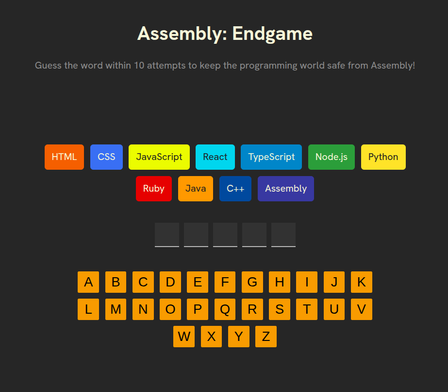
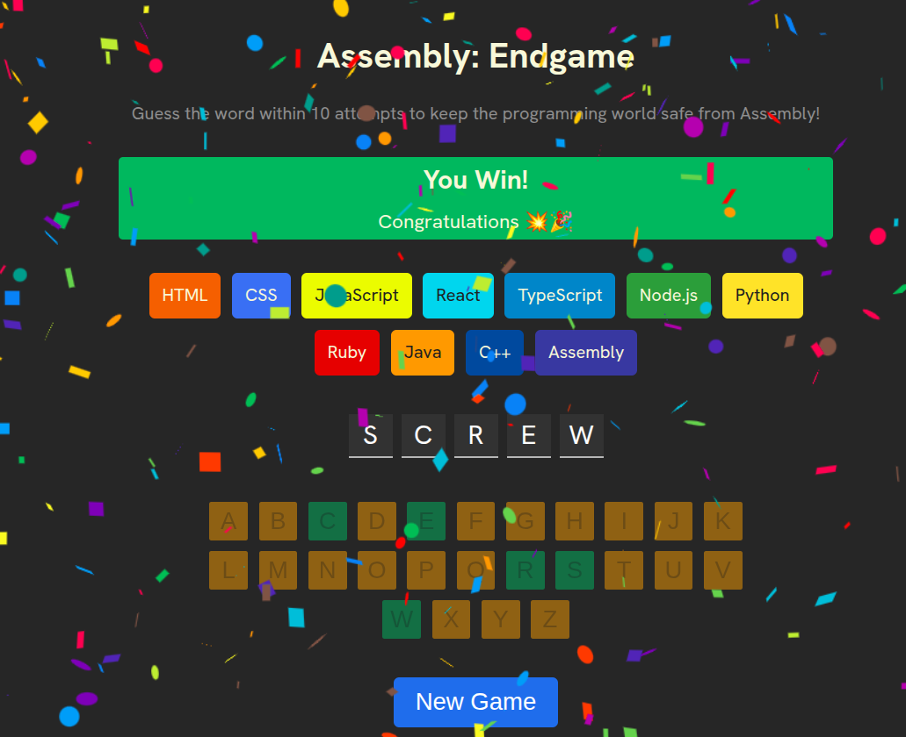
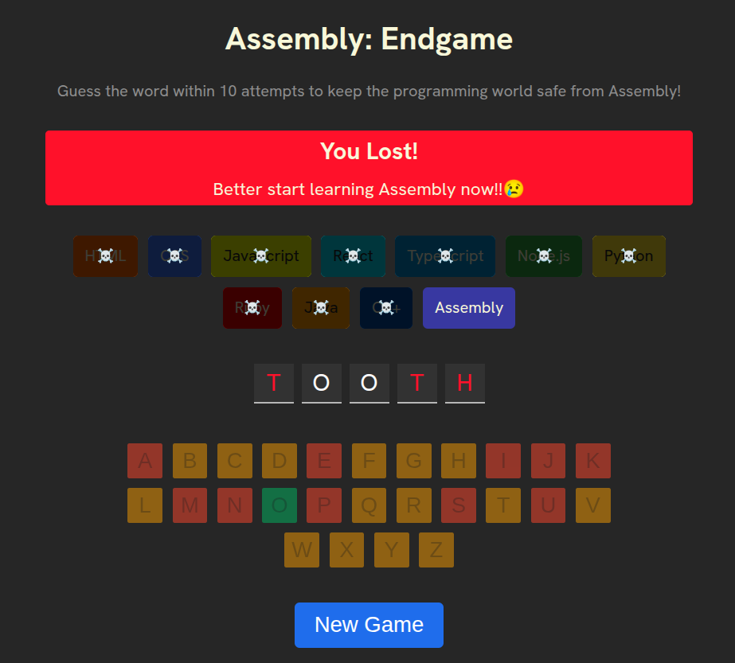

# 🎮 Assembly: Endgame

A Hangman-style word-guessing game with a twist 🌀 - every wrong guess wipes out a programming language ☠️. Survive long enough and you save the programming world 🌍 from being reduced to Assembly.

⚛️ Built with React 19 + ⚡ Vite.



## 🕹️ Gameplay

- 🎲 A random word is selected at the start of each game.
- ⌨️ Guess one letter at a time using the on-screen keyboard.
- ❌ Each **incorrect** guess kills off one programming language (HTML → CSS → JavaScript → React → … → Assembly).
- 💀 You have **10 attempts**. If Assembly is the only language left standing, you lose.
- 🎉 Reveal the full word before running out of languages and you win -- confetti included 🎊.

### ✨ Visual feedback

- ✅ Correct letters turn the keyboard key **green**; ❌ incorrect letters turn **red**.
- 🪦 Each wrong guess displays a randomized farewell message for the language you just lost (e.g. *"R.I.P., JavaScript 🥲"*).
- 🔍 On a loss, the unguessed letters of the target word are revealed in red.

### 📸 Screenshots

🏆 **Victory** — guess the word in time and the confetti rains down:



💀 **Defeat** — run out of languages and only Assembly survives:



## 🛠️ Tech Stack

- ⚛️ **React 19** — UI
- ⚡ **Vite 8** — dev server and build
- 🎨 **clsx** — conditional class names
- 🎊 **react-confetti** — win animation
- 🧹 **ESLint** — linting (with `react-hooks` and `react-refresh` plugins)

## 🚀 Getting Started

### 📋 Prerequisites

- 🟢 Node.js (a version compatible with Vite 8)
- 📦 npm

### ⚙️ Install & run

```bash
npm install
npm run dev
```

🌐 Then open the local URL printed by Vite (typically `http://localhost:5173`).

### 📜 Other scripts

```bash
npm run build     # 🏗️  Production build to ./dist
npm run preview   # 👀 Preview the production build locally
npm run lint      # 🧹 Run ESLint
```

## 📁 Project Structure

```
.
├── 📄 index.html
├── ⚙️  vite.config.js
├── 🧹 eslint.config.js
├── 📦 package.json
└── 📂 src/
    ├── 🚪 main.jsx                  # React entry point
    ├── 🧠 App.jsx                   # Game state + composition
    ├── 🎨 index.css                 # All styling
    ├── 📂 components/
    │   ├── 🏷️  Header.jsx            # Title and intro
    │   ├── 📊 Status-Section.jsx    # Win / loss / farewell banner
    │   ├── 🏳️  Languages.jsx         # Language chips (with skull overlay when "lost")
    │   ├── 🔤 Words.jsx             # Letter slots for the target word
    │   ├── ⌨️  Keyboard.jsx          # On-screen A–Z keyboard
    │   └── 🔄 Newgame.jsx           # Reset button (shown on game over)
    └── 📂 utils/
        ├── 🏳️  language.js           # Language list + colors
        ├── 📚 words.js              # Word pool
        └── 👋 farewell.js           # Random farewell messages
```

## 🔧 How It Works

🧠 State lives in `App.jsx`:

- 🔤 `currentWord` — the word to guess, picked randomly from `utils/words.js`.
- ⌨️ `keyboard` — the array of letters the player has guessed so far.

📐 Derived values drive the UI:

- ❌ `wrongGuessCount` — guessed letters not in the word.
- 🏆 `gameWon` — every letter of `currentWord` is in `keyboard`.
- 💀 `gameLost` — `wrongGuessCount` reaches `languages.length - 1` (10 wrong guesses).

👆 Clicking a key calls `guessInput`, which appends the letter to `keyboard` (de-duplicated). 🔄 Clicking **New Game** picks a fresh word and clears the guesses.

## 📄 License

📚 This is a **personal study project**. See [LICENSE](./LICENSE) for terms — free for personal and educational use, no commercial use without permission.
